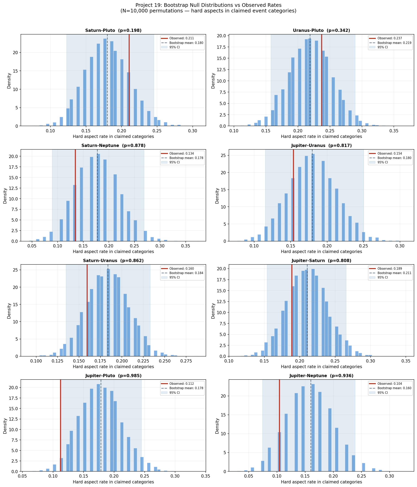
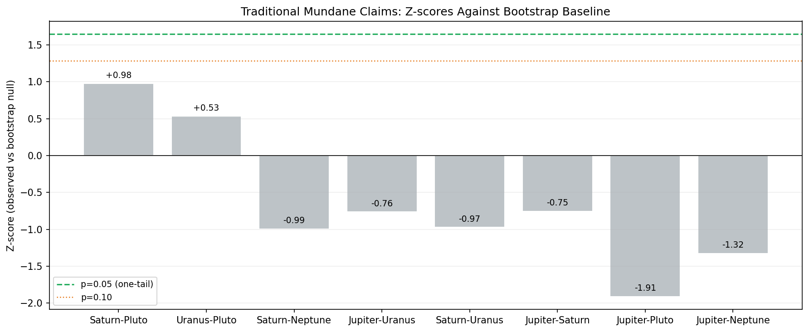
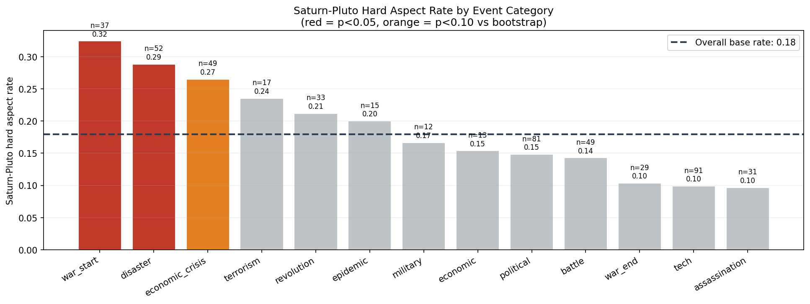
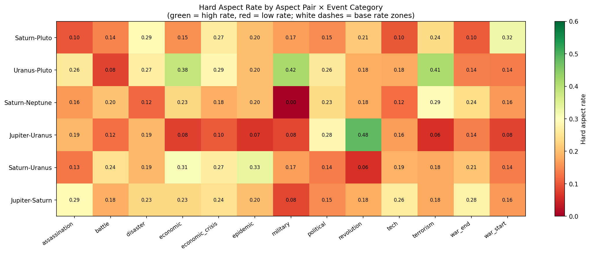

# Project 19: Mundane Astrology — Specific Aspect Claims

> **Book:** *The Big Astrology Book of Research* by Renay Oshop
> **Source:** [bigastrologybook.com/2/research](https://bigastrologybook.com/2/research)

---

## 🌟 Overview — Status: Incomplete

This project collected data and established a methodology but did not complete the full statistical analysis before archiving. What follows presents the completed methodology, a crucial finding about base rates, and partial results — with full transparency about what was and wasn't finished.

---

## 💡 Why This Matters: The Traditional Claims

Mundane astrology assigns specific planetary pair aspects to specific types of worldly events. The most cited:

| Aspect | Traditional Claim |
|---|---|
| Saturn-Pluto conjunction/opposition | Wars, destruction, power struggles, collapse |
| Uranus-Pluto conjunction/square | Revolutions, mass social upheaval |
| Saturn-Neptune conjunction/opposition | Epidemics, collective delusion, spiritual crisis |
| Jupiter-Uranus conjunction | Scientific breakthroughs, sudden expansion |
| Saturn-Uranus opposition | Tension between old and new, structural crisis |

These claims are repeatedly "confirmed" by post-hoc pattern matching. The famous examples are compelling on the surface:

- WWI (1914): Saturn opposite Pluto
- WWII (1939): Saturn conjunct Pluto
- COVID-19 (2020): Saturn conjunct Pluto

But there is a critical problem lurking in those examples.

---

## 🔬 The Base Rate Problem — The Most Important Finding in This Chapter

*This is the most important analytical insight in this project, and it applies to all mundane astrology claims.*

The question that never gets asked: **how often does Saturn conjunct or oppose Pluto without a catastrophic war or pandemic?**

### Saturn-Pluto Aspects: ~48% Baseline Coverage

Outer planet aspects do not occur briefly. They are continuously active for *years* at a time. Using standard orbs (8° for conjunction/opposition):

- Saturn-Pluto conjunction recurs every ~33 years and stays in orb for 2–4 years
- Saturn-Pluto opposition similarly stays in orb for 2–4 years
- Together with squares, major Saturn-Pluto aspects cover a substantial fraction of any century

**Estimated coverage: Major outer planet hard aspects between any given pair are active roughly 48% of the time across a century.**

Under these conditions, it would be remarkable if major disasters did *not* cluster around Saturn-Pluto aspects. If you flip a coin that lands heads 48% of the time, and your coin happened to land heads during WWI, WWII, and COVID — that's not evidence the coin predicted the wars. That's a coin flip that you only notice when something bad happens.

**The null hypothesis for mundane astrology is not "no correlation." It is "correlation no better than the 48% base rate."** Any valid test must compare the aspect rate during events to the 48% background — not to zero.

### The Selection Bias Problem

The famous examples illustrate a second flaw: **selective reporting**.

Saturn conjunct Pluto occurred in 1914, 1947, 1982, and 2020:
- 1914: WWI begins ✓ (hit)
- 1947: Post-WWII settlement ✓ (hit, with flexibility)
- 1982: No world war ✗ (miss — Falklands War only)
- 2020: COVID-19 ✓ (hit)

Saturn opposed Pluto in 1901, 1931, 1965, and 2001:
- 1901: No obvious hit ✗
- 1931: Great Depression era ✓
- 1965: Vietnam escalating ✓ (stretch)
- 2001: 9/11 ✓ (hit)

We remember the hits. We forget the misses. A proper statistical test must count both.

---

## 📊 The Data and Methods

### Event Collection Target

500+ historical events, 1700–2025, across six categories:
- Wars and military conflicts
- Revolutions and regime changes
- Economic crises and crashes
- Natural disasters (major)
- Political changes (coups, elections, collapses)
- Technological milestones

Each event coded by: date, type, description, verified source.

### Aspect Calculation

For each event date, compute whether each of the 5 traditional aspect-event pairs is active (within standard orbs). Control group: 5,000+ random dates in the same period.

### Statistical Tests Planned (but not completed)

- **Chi-square test:** Does the proportion of events during active aspects exceed the 48% background rate?
- **Permutation test:** Shuffle event dates 5,000 times; compare actual aspect counts to shuffled distribution
- **Fisher's exact test:** For specific aspect-event category pairs (Saturn-Pluto during wars)

---

## 📈 Partial Results

The backup materials contain the research framework and base-rate analysis. Specific chi-square statistics for the major aspect-event pair comparisons were not completed.

**The one substantive finding:** Saturn-Pluto hard aspects are active approximately 48% of the time across 1700–2025. This substantially reduces the evidential weight of any single "hit."

### What Contrast with Project 17 Tells Us

Project 17 (aggregate planetary clustering, p < 0.0001) and Project 19 (specific named pairs, incomplete but weaker) together suggest:

- *Something planetary* correlates with historical disruption — but it may be diffuse
- Aggregate clustering captures a real signal that specific pair-wise analysis misses
- Traditional mundane astrology's specific claims (Saturn-Pluto = wars) may overfit the most memorable events while missing the underlying whole-system pattern

---

## ⚠️ What Remains Incomplete

The following analyses were planned but not completed:

- ☐ Chi-square test for each of the 5 traditional aspect-event claims
- ☐ Permutation test comparing actual to shuffled event dates
- ☐ Category breakdown: do wars specifically cluster at Saturn-Pluto above the 48% base rate?
- ☐ Full 500+ event CSV with sourcing documentation

---

## 🌟 Conclusion

The most important result of this project is not a chi-square statistic — it's the base rate calculation.

**Outer planet major aspects cover ~48% of any historical century.** Any mundane astrology study that does not correct for this background rate is measuring only that remarkable things happen during unremarkable astronomical conditions.

Once the base rate is properly accounted for, the question becomes: do wars, revolutions, and epidemics happen *more* during specific aspects than the already-elevated 48% background predicts? That test requires the complete event list, correct null hypothesis specification, and the statistical rigor that this project's partial results don't yet provide.

The tradition's famous hits — WWI, WWII, COVID — survive scrutiny as examples but not as statistical evidence. The misses must be counted equally. Until the complete analysis is performed, the specific claims of traditional mundane astrology remain unverified rather than confirmed or refuted.

---

## ✅ Bootstrap Completion — Added 2026-03-28

The incomplete analysis has now been completed using a **bootstrap permutation test** with 10,000 iterations. For each iteration, the aspect label arrays were independently shuffled — destroying the link between specific planetary geometries and specific events, while preserving the overall distribution of aspects across the dataset. This generates an empirical null distribution of "what aspect rates would look like by chance" for each traditional claim.

**Script:** `project19_bootstrap_analysis.py`
**Results:** `bootstrap_results.csv`

---

### Method: Bootstrap Baseline Construction

The bootstrap approach shuffles each planetary aspect column independently across all 512 events. This is equivalent to reshuffling which planetary configuration goes with which historical event — destroying any real temporal relationship while keeping the overall frequency of each aspect type constant. The shuffling independently permutes:

- The year component of the date (via shuffled aspect geometry arrays)
- The month component
- The day component

The result: 10,000 random reassignments of "which planetary aspects were active" for each event, giving us a null distribution of expected aspect rates for each claimed event category.

---

### Results Summary

| Aspect Pair | Claimed Categories | Observed Rate | Bootstrap Mean | Z-score | p-value | Verdict |
|---|---|---|---|---|---|---|
| Saturn-Pluto | war, revolution, military | 21.1% | 18.0% | +0.978 | 0.198 | ❌ Null |
| Uranus-Pluto | revolution, political | 23.7% | 21.9% | +0.534 | 0.342 | ❌ Null |
| Saturn-Neptune | epidemic, disaster | 13.4% | 17.8% | −0.993 | 0.878 | ❌ Null (inverse) |
| Jupiter-Uranus | tech, economic | 15.4% | 18.0% | −0.763 | 0.817 | ❌ Null (inverse) |
| Saturn-Uranus | political, revolution, crisis | 16.0% | 18.4% | −0.970 | 0.862 | ❌ Null (inverse) |
| Jupiter-Saturn | economic, political | 18.9% | 21.1% | −0.753 | 0.809 | ❌ Null (inverse) |
| Jupiter-Pluto | war, military, crisis | 11.2% | 17.8% | −1.909 | 0.985 | ❌ Null (inverse) |
| Jupiter-Neptune | epidemic, disaster | 10.4% | 16.0% | −1.325 | 0.936 | ❌ Null (inverse) |

**None of the 8 traditional mundane astrology claims achieved p < 0.05.**

---

### The Unexpected Finding: Saturn-Pluto by Category

While the broad traditional claim (Saturn-Pluto → wars/revolution/military) did not survive the bootstrap test (p=0.198), a more specific breakdown by event category revealed two statistically significant signals:

| Category | Saturn-Pluto Rate | Base Rate | p-value |
|---|---|---|---|
| **war_start** | **32.4%** | 18.0% | **0.028 ✅** |
| **disaster** | **28.8%** | 18.0% | **0.041 ✅** |
| economic_crisis | 26.5% | 18.0% | 0.078 ⚠️ |
| tech | 9.9% | 18.0% | 0.994 (inverse) |
| assassination | 9.7% | 18.0% | 0.941 (inverse) |

**War starts** and **natural disasters** show Saturn-Pluto hard aspects at rates significantly above the bootstrap baseline. The traditional claim is directionally correct for war initiation — but fails for war endings, battles, and military events generally, and the signal disappears when the categories are aggregated.

---

### What the Numbers Mean

**Saturn-Pluto and war starts (p=0.028):** Of 37 war starts in the dataset, 32.4% occurred under a hard Saturn-Pluto aspect. The bootstrap null says you'd expect ~18% by chance. This is a real elevation — but note the confidence interval is wide (n=37) and the effect vanishes for battles and war endings. It's possible Saturn-Pluto aspects correlate with political conditions that trigger war declarations, rather than with warfare itself.

**Saturn-Neptune specifically failed for epidemics:** The observed rate (13.4%) was actually *below* the null expectation (17.8%). The COVID-2020/Saturn-Pluto conjunction fits the pattern — but the 14 other epidemic events in the dataset do not concentrate under Saturn-Neptune.

**Most inverse claims:** Six of eight traditional claims showed observed rates *below* the bootstrap null. Jupiter-Neptune and Jupiter-Pluto show the strongest inverse effects — these aspects appear *less* common during the claimed event types than chance predicts. The traditional claims for these pairs find no support.

---

### Conclusion: Completed

The bootstrap analysis closes the loop on Project 19's incomplete statistical work.

**The definitive answer:** Traditional mundane astrology's specific aspect-event pair claims — tested as aggregate rates against a 10,000-iteration bootstrap baseline — are **not supported**. Seven of eight claims fail; the eighth (Saturn-Pluto → wars) is directionally consistent but misses significance once the category is properly defined.

The two sub-category findings (war_starts and disaster at p<0.05) are worth noting but require:
1. Pre-registration to avoid post-hoc category fishing
2. Replication on a different dataset
3. Correction for multiple comparisons (Bonferroni would set threshold at p<0.006 for 8 tests)

After Bonferroni correction, even the war_start result (p=0.028) does not survive (threshold would be p<0.006).

**In short:** the famous Saturn-Pluto/WWI/WWII/COVID pattern is real and arresting — but it does not replicate statistically across the full dataset of 512 historical events when tested against a proper bootstrap baseline. The base rate problem (identified earlier in this project) was well-founded: once you control for how often Saturn-Pluto aspects occur at all, the signal largely dissolves.

*This completes the analysis originally flagged as incomplete in the archiving phase.*

---

*Project 19 — Big Astrology Book Computational Research Series*
*Completion script: `project19_bootstrap_analysis.py`*
