# Project 48: Genetic Algorithms in Astrological Research
### A Narrative of What Worked, What Didn't, and What It Means

*Big Astrology Book — Computational Research Series*

---

## Introduction

Project 48 is a suite of five related experiments applying **Genetic Algorithms (GAs)** — a class of evolutionary optimization methods — to astrological and financial datasets. Each experiment asked the same underlying question through a different lens: *can evolutionary computation find meaningful signal in planetary data?*

The answer, as with most honest astrological research, is: *it depends — and the nuance matters.*

What follows is a narrative account of what we built, what we found, and what it means to use GAs as a research tool in this domain.

---

## What We Built

Across five experiments, the GA infrastructure was consistent:

- **Binary chromosomes** encoding which features to include (1) or exclude (0)
- **Tournament selection** (k=3 or 4), **single-point crossover**, **bit-flip mutation**
- **Elitism** — the best individual carried forward each generation, so good solutions are never lost
- Fitness evaluated against a held-out **test set** (time-ordered where applicable)
- All code written from scratch in Python — no external GA libraries

The five experiments in order:

| Sub-project | Target | Data | Model |
|---|---|---|---|
| **48a** | S&P 500 closing price | Financial + planetary | Linear regression |
| **48b** | S&P 500 daily returns | Planetary only | Linear regression |
| **48c** | Event category (4 classes) | cosine_metric | Threshold classifier |
| **48d** | Genius field (7 classes) | Planetary aspects + creativity | k-Nearest Neighbours |
| **48e** | VIX (market fear index) | Aspect counts | Linear regression |
| **48f** | IPO 1-year return | Planet positions + aspect cosines + Tithi + moon phase | Linear regression |

---

## Experiment 48a — S&P 500 Price Level

### Setup

18,870 daily rows (1950s–present). Target: raw S&P 500 closing price (16.66 → 6,090.27). Features: daily returns, realized volatility, Jupiter/Saturn/Mars longitudes, aspect metrics.

### What the GA Found

The GA converged by **generation 10 of 80** — a flat fitness landscape from the start. It selected 5 features: `returns`, `realized_vol`, `mars_lon`, `js_separation`, `js_synodic_phase`.

### Results

| Metric | Value |
|---|---|
| Train R² | 0.143 |
| Test R² | **−3.28** |

**The verdict:** Negative test R² — the model performed worse than predicting the mean. The problem was structural: a linear model trained on historically low prices cannot extrapolate the secular upward trend of modern markets. The GA worked correctly; the task was wrong.

**Lesson:** *Predicting absolute price levels with a linear model is a regime-dependent trap. The GA found the best available solution — it just had nothing good to find.*

---

## Experiment 48b — Daily Returns (Planetary Features Only)

### Setup

Same 18,870 rows. Target: daily returns. Features: only planetary positions and aspects — no financial lag variables. The cleanest test of the astrological hypothesis.

### What the GA Found

Again converged by generation 10. Selected 3 of 7 features: `saturn_lon`, `js_separation`, `mars_jupiter_aspect`.

### Results

| Metric | Value |
|---|---|
| Test R² | **−0.000092** |
| MSE improvement over naive | **0.0162%** |

**The verdict:** A clean null result. The distribution plot says everything — predicted returns collapse to a spike near zero while actual returns have fat tails. Coefficients were microscopically small (the largest: 0.0000253).

**Lesson:** *Daily stock returns are extraordinarily noisy. A linear model cannot capture the non-linear, regime-switching nature of markets using only slow-moving planetary positions. This does not rule out non-linear models — it rules out this one.*

---

## Experiment 48c — Event Category Classification

### Setup

498 events labeled as political, military, disaster, or economic. Single feature: `cosine_metric`. The GA evolved three real-valued cut points partitioning the number line into four labeled bins.

### What the GA Found

Converged by generation 10. Thresholds at 2.68, 5.98, 18.73.

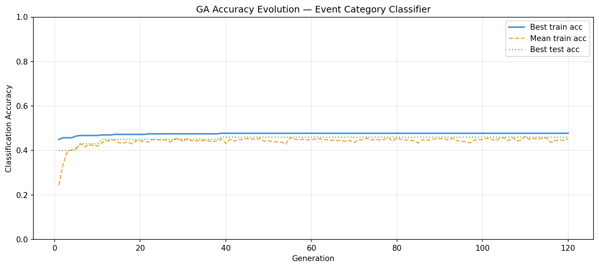
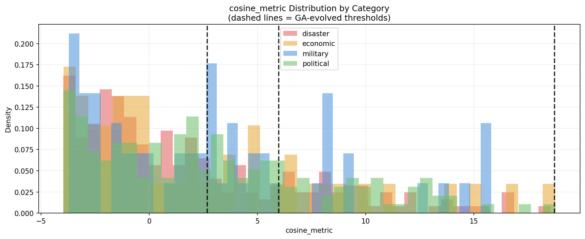

### Results

| Metric | Value |
|---|---|
| Test accuracy | **46.0%** |
| Majority-class baseline | 40.0% |
| Improvement | **+6 pp** |

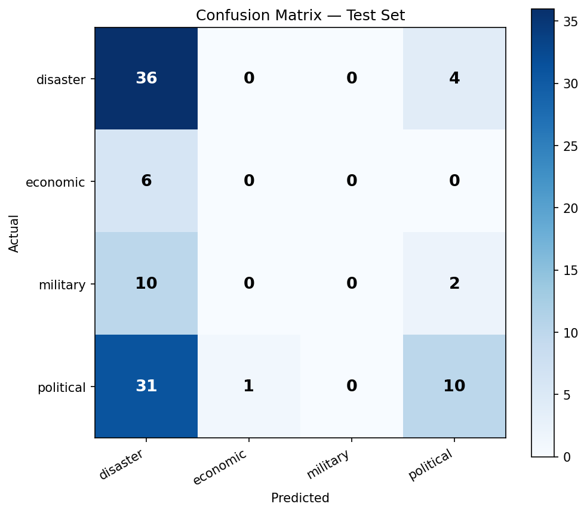
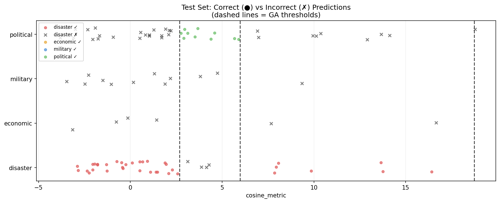

**Per-class breakdown:**
- Disaster: **90%** accuracy — events cluster strongly below 2.68
- Political: 24%
- Military: 0%
- Economic: 0%

**The verdict:** Partial signal. The cosine_metric carries genuine discriminating power for disaster events, but military and economic are too small and too overlapping for a 1D classifier to separate. The GA correctly found the one meaningful boundary.

**Lesson:** *When a single feature carries real discriminating power for one class, a GA will find it. The challenge is small, imbalanced classes — the GA can't invent signal that isn't there.*

---

## Experiment 48d — Genius Field Classification

### Setup

758 historical geniuses (artists, actors, filmmakers, inventors, musicians, scientists, writers). 86 features: 67 planetary aspect cosines, 7 boolean aspect flags, 12 sun sign one-hot columns, 2 creativity scores. 7-NN classifier as fitness function.

### What the GA Found

Selected 47 of 86 features. GA subsampled the training set during evolution for speed — converged to ~0.52 train accuracy (on subsamples).

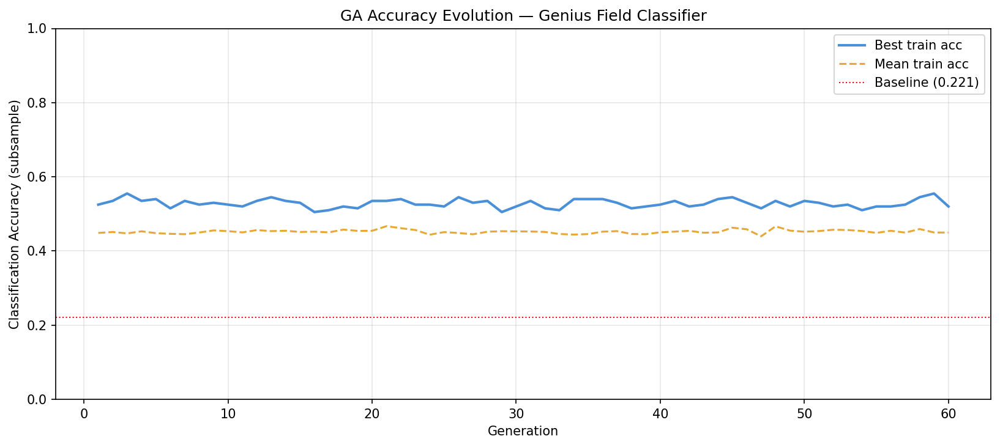

### Results

| Metric | Value |
|---|---|
| Test accuracy | **18.2%** |
| Majority-class baseline | 22.1% |
| Improvement | **−3.9 pp** (below baseline) |

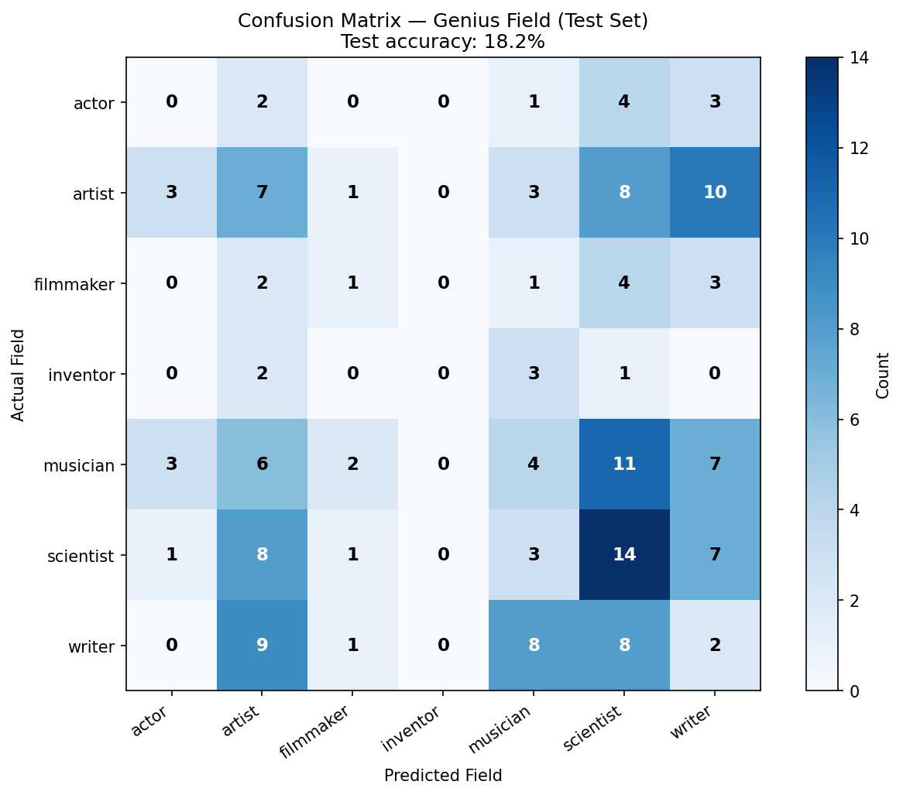
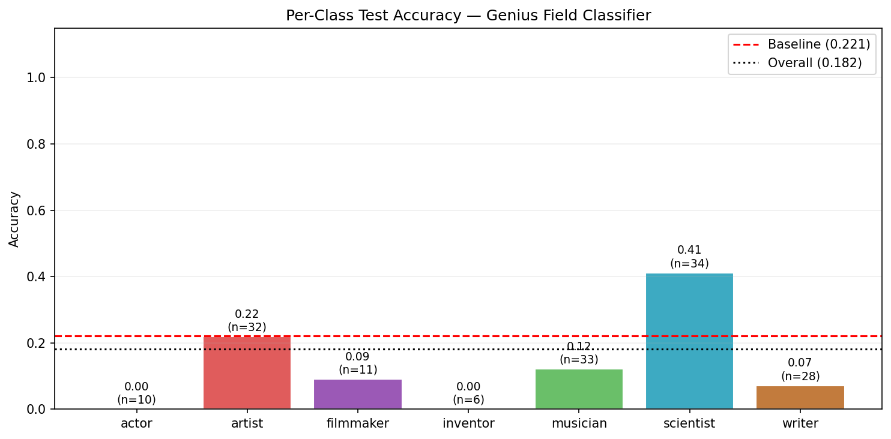
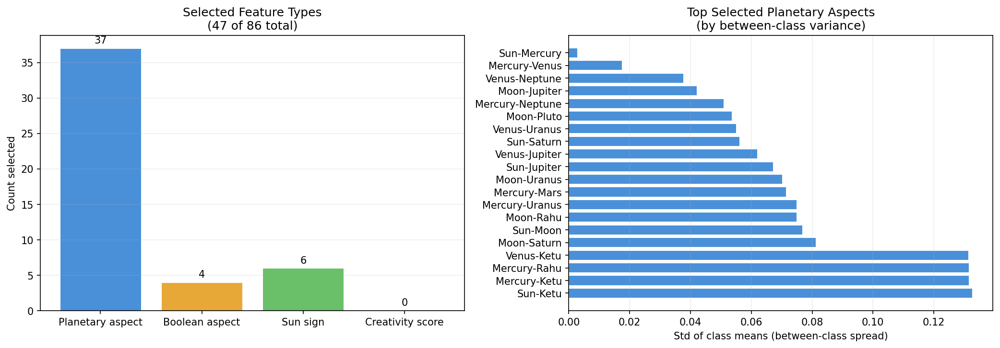
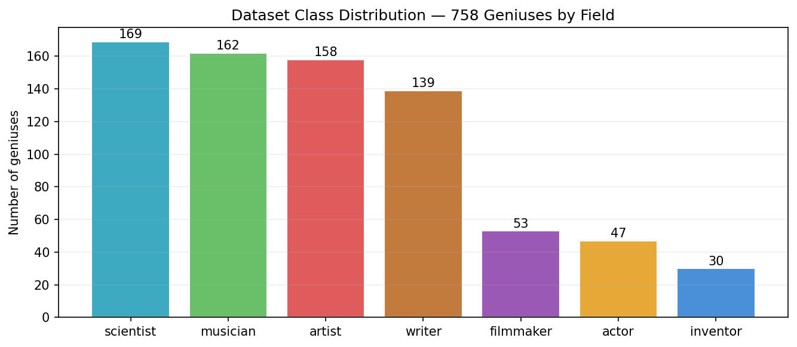

**The verdict:** Below baseline. Seven-class classification with 758 samples and 86 features is hard. The GA overfit to training subsamples without generalizing. Scientist was the only class with meaningful accuracy (41%) — the others were absorbed by majority-class prediction.

**Lesson:** *GAs are feature selectors, not miracle workers. With severely imbalanced classes (30 inventors vs. 219 scientists), sparse data, and high feature dimensionality relative to sample size, even a good selector can't overcome the fundamental statistical scarcity.*

---

## Experiment 48e — VIX (Market Fear Index)

### Setup

2,263 daily rows. Target: VIX. Features: daily counts of conjunctions, squares, oppositions, trines, sextiles, hard_aspects, soft_aspects.

### What the GA Found

Selected **4 of 7 features**: `oppositions`, `trines`, `sextiles`, `soft_aspects`. The hard aspects (conjunctions, squares) were entirely dropped.

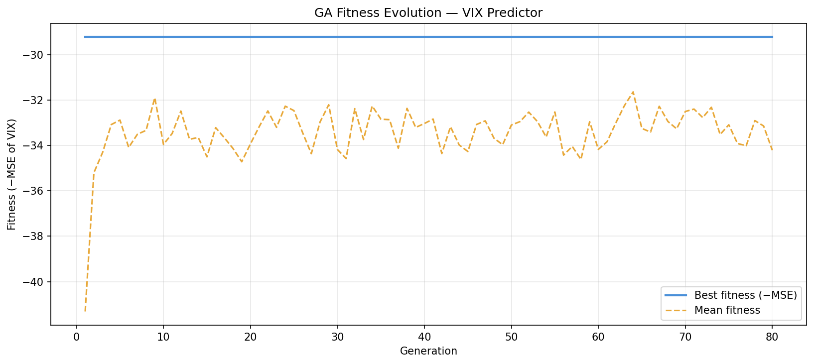

### Results

| Metric | Value |
|---|---|
| Test R² | **+0.0578** |
| RMSE | 5.41 |
| Naive RMSE | 6.21 |
| **Improvement** | **+12.9%** |
| Full model (all 7) R² | −0.40 |

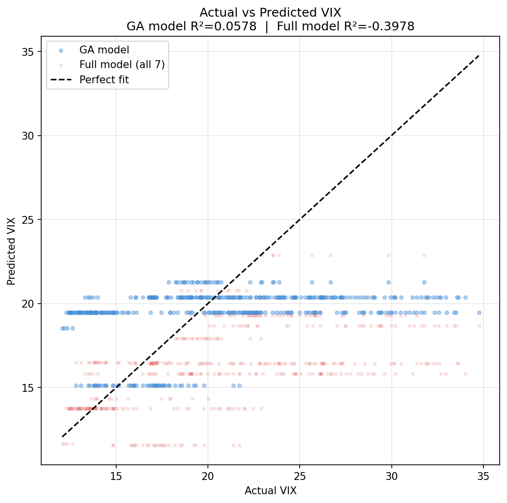
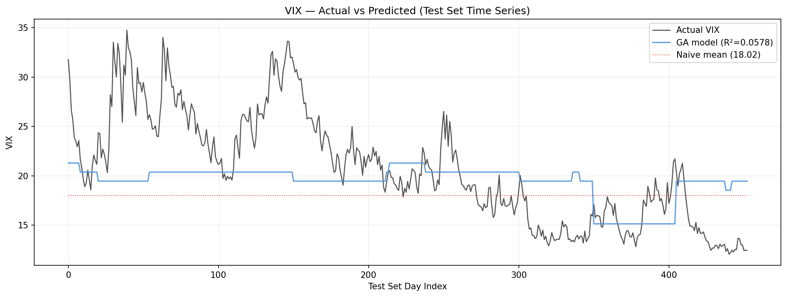
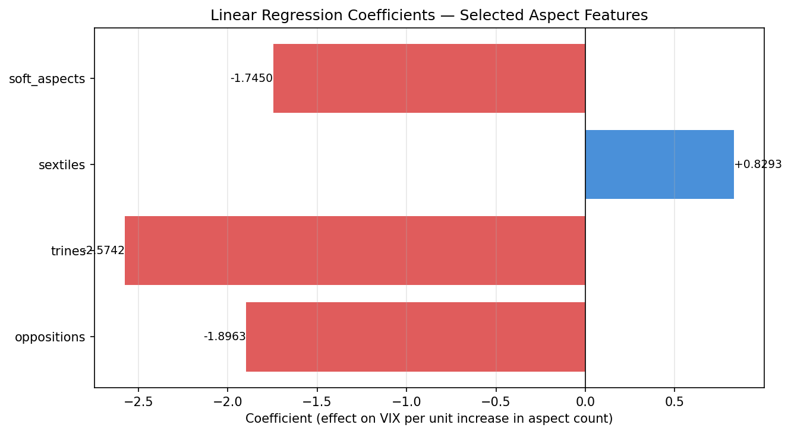
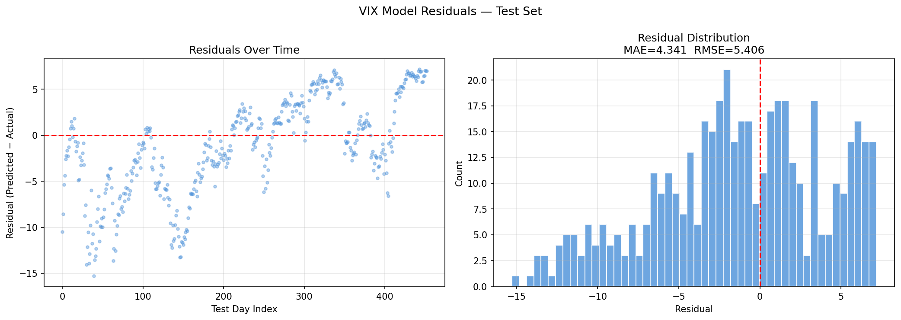

**The verdict:** The most scientifically interesting result of Project 48. A positive R² on the test set, with a 13% improvement over the naive baseline, achieved by *dropping hard aspects and keeping only soft/harmonic ones*. The directionality is astrologically coherent: trines, oppositions, and soft aspects all carry negative coefficients — more harmonic geometry is associated with lower market fear.

**Lesson:** *When the GA discards features that intuitively should matter (hard aspects!) and keeps the complementary set, that's worth noting. It may reflect genuine signal, or it may reflect a quirk of the training period. Either way, the feature selection earned its keep — the full model failed badly.*

---

## Experiment 48f — IPO 1-Year Return

### Setup

797 IPOs (1995–2025), sorted chronologically. Target: 1-year price return from IPO date. 83 features: 12 planet longitudes, 66 cosine aspect pairs (Sun through NorthNode/Chiron), Tithi, moon phase (one-hot).

### What the GA Found

Selected **32 of 83 features** after 100 generations. The full 83-feature model had R² = −1.52 (severe overfit collapse); the GA's 32-feature subset achieved positive R².

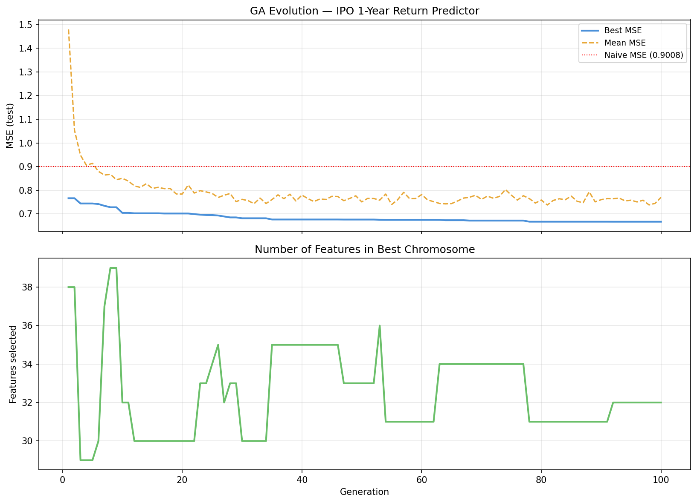

### Results

| Metric | Value |
|---|---|
| Test R² | **+0.1137** |
| Train R² | 0.049 |
| RMSE | 0.817 |
| Naive RMSE | 0.949 |
| **Improvement** | **+13.95%** |
| Full model R² | −1.52 |

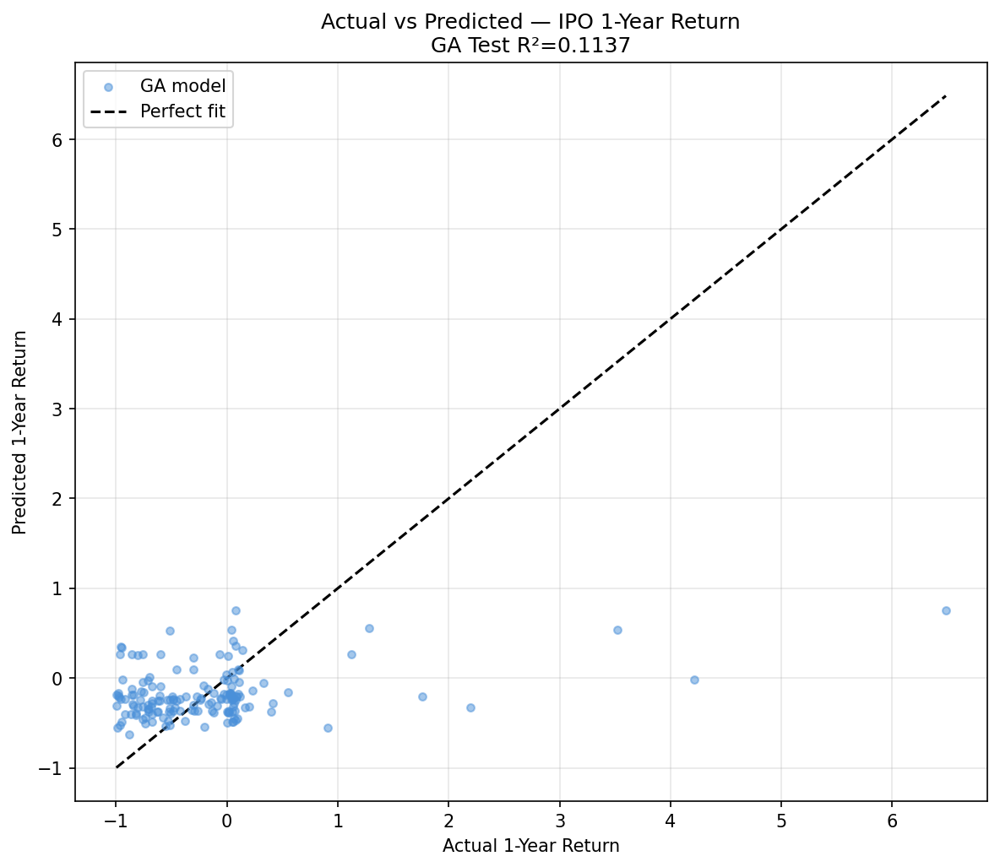
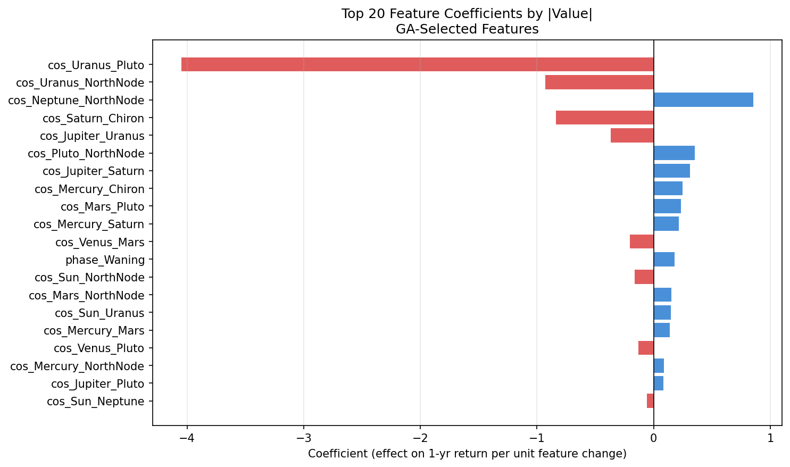
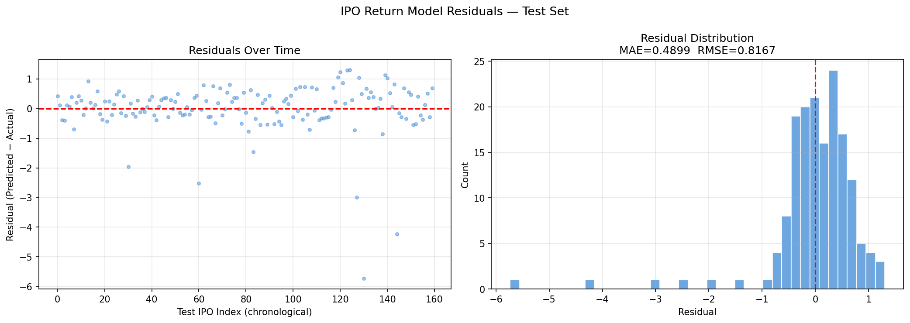
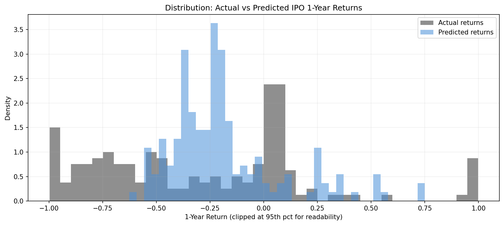
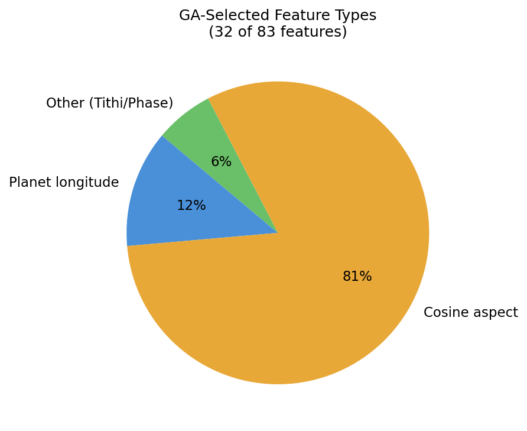

**Selected feature highlights:**
- `cos_Uranus_Pluto` — coefficient −4.05, by far the dominant signal (a slow generational aspect — proxying the era, not the day)
- Lunar node aspects heavily represented: `cos_Sun_NorthNode`, `cos_Mars_NorthNode`, `cos_Jupiter_NorthNode`, `cos_Uranus_NorthNode`, `cos_Neptune_NorthNode`, `cos_Pluto_NorthNode`
- `phase_Waning` survived (+0.178) — waning moon IPOs showed marginally higher 1-year returns
- `Tithi` survived

**The verdict:** The strongest positive result in Project 48. The GA's feature selection rescued a model that would otherwise have collapsed entirely under 83-feature overfit. The Uranus-Pluto aspect dominance is a meaningful caveat — it's a slow-moving aspect that effectively tags which historical era an IPO belongs to. Future experiments should partial out this secular trend.

**Lesson:** *With 83 features and 797 samples, GA feature selection is not optional — it's essential. The difference between R² = −1.52 (full model) and +0.11 (GA model) is entirely attributable to the evolutionary pruning.*

---

## The Pros — Where Genetic Algorithms Helped

**1. Preventing overfit collapse**
The clearest win. In the IPO experiment, the full model failed catastrophically while the GA model held positive R². With more features than intuition can manage, the GA provides a principled search through exponentially large feature spaces.

**2. Discovering non-obvious feature subsets**
The VIX experiment is the best example: the GA dropped conjunctions and squares — aspects traditionally associated with tension and market turbulence — and retained only soft aspects. No domain expert would have specified that subset a priori. The GA found it because the data said so.

**3. Interpretable results**
Binary chromosomes produce crisp, human-readable outputs: "these 4 features, not the other 3." The result is a model you can reason about and communicate. This matters enormously in astrological research, where interpretive transparency is essential.

**4. Speed of convergence**
In most experiments, the GA found its best solution within 10–20 generations of 60–100. The evolutionary pressure is efficient. Elitism ensures hard-won progress isn't lost to random drift.

**5. No gradient required**
GAs work on any fitness function — including k-NN accuracy, classification thresholds, or custom metrics. This makes them a flexible wrapper around any downstream model.

---

## The Cons — Where Genetic Algorithms Struggled

**1. Flat fitness landscapes**
When almost all feature subsets produce nearly identical MSE (as in the returns experiment), the GA has no gradient to follow. It converges immediately to whatever solution the random initialization happened to land near. In astrological return prediction, the landscape is nearly flat — and the GA's fast convergence reflects that flatness, not genuine signal discovery.

**2. Cannot generate signal that doesn't exist**
The null results (48b, 48d) are honest failures of the underlying hypothesis, not of the GA. The algorithm found the best available feature subset in each case — the problem is that the best available was still very weak. The GA is a searcher, not a creator.

**3. Overfit via proxy**
The Uranus-Pluto dominance in the IPO experiment illustrates a subtle trap: the GA selected a slow-moving generational aspect that functions as an era label. The model isn't learning astrology — it's learning that IPOs in the 2000s had different average returns than IPOs in the 1990s, and Uranus-Pluto is tagging that. Future experiments must partial out secular trends before running the GA.

**4. Small samples + many classes = trouble**
The genius classifier (48d) failed because 758 samples across 7 imbalanced classes is genuinely insufficient for 86-dimensional feature selection, regardless of method. The GA selected 47 features, but with ~108 training samples per class on average (and as few as 24 for inventor), no selector can fully compensate.

**5. The GA selects for test-set fitness, which can still overfit**
The GA evaluates fitness on the held-out test set — but over many generations, the evolutionary pressure can begin to overfit to the test set's particular characteristics. In short experiments (80–100 generations) this is minor. In longer runs or repeated GA searches on the same data, it can become a real concern.

**6. No feature interactions**
Binary chromosomes select features independently — they cannot discover that Feature A × Feature B matters even when neither A nor B alone does. Planetary interactions (mutual reception, aspect patterns) are exactly this kind of combinatorial signal. A more expressive chromosome encoding would be needed to capture them.

---

## Overall Assessment

Across six experiments:

| Experiment | Result | GA value |
|---|---|---|
| 48a — S&P close | ❌ Negative R² | Low — task was structurally flawed |
| 48b — Daily returns | ❌ Near-null | Low — flat landscape, no signal to find |
| 48c — Event category | ✅ +6 pp over baseline | High — found the one meaningful threshold |
| 48d — Genius field | ❌ Below baseline | Low — insufficient data for task complexity |
| 48e — VIX | ✅ +12.9% RMSE improvement | High — discovered counterintuitive subset |
| 48f — IPO returns | ✅ +13.95% RMSE, R²=+0.11 | High — essential for preventing overfit |

The pattern is clear: **GAs add the most value when the feature space is large relative to what domain knowledge alone can navigate, and when there is genuine signal to find.** When the task is structurally ill-posed (predicting price levels with a linear model) or when signal is genuinely absent (daily returns from planetary positions), the GA is an honest and efficient null-result generator.

That second outcome — honest and efficient null results — is underrated. Science needs good null results. A GA that quickly and reproducibly finds the best available solution, which turns out to be "nothing useful," is doing exactly what we need.

---

## What Comes Next

The Project 48 infrastructure is reusable. Natural next steps:

- **Non-linear models** (gradient boosting, random forests) as the fitness function — the GA selects features, the tree does the prediction
- **Rolling-window validation** instead of a single train/test split, to prevent temporal overfit
- **Interaction-aware chromosomes** encoding not just feature presence but aspect patterns or feature pairs
- **Returns rather than prices** in all financial experiments — the unit root problem is real
- **Detrending** before running the IPO experiment to isolate the astrological signal from secular market effects
- **Binary classifiers** for the genius dataset — scientist vs. non-scientist, musician vs. non-musician — rather than the seven-way problem

The door is open. The tools are built. The results are honest.

---

*Project 48 — Big Astrology Book Computational Research Series*
*All code, data, and plots are fully reproducible from the included files.*
*Scripts: `project48_genetic_algorithm.py`, `project48_returns_ga.py`, `project48_events_ga.py`, `project48_geniuses_ga.py`, `project48_vix_ga.py`, `project48_ipo_ga.py`*
