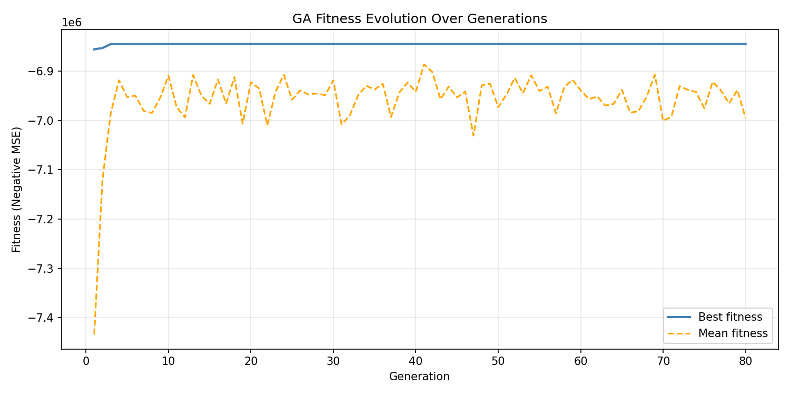
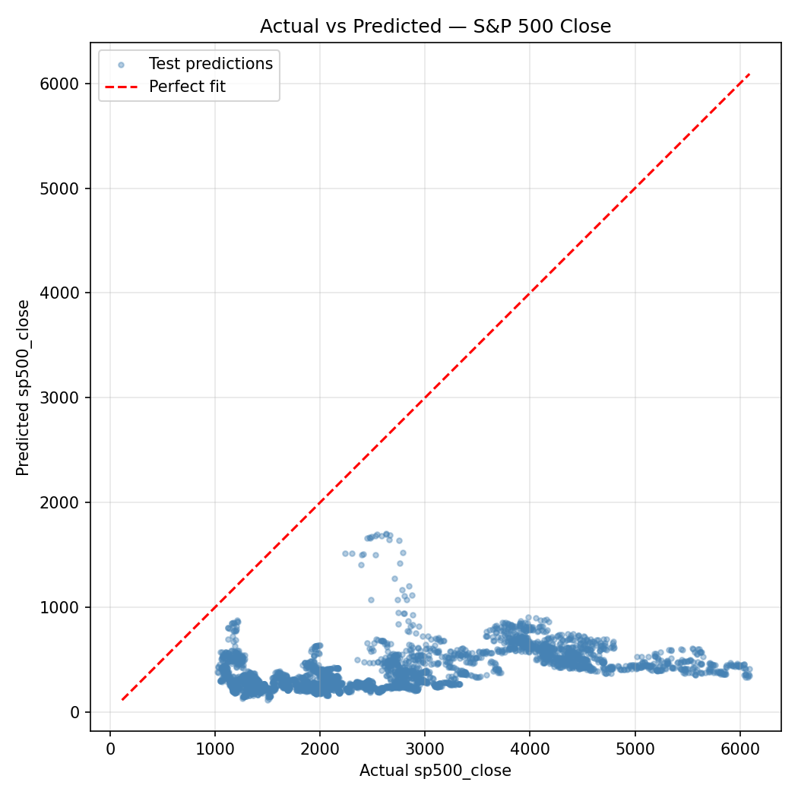
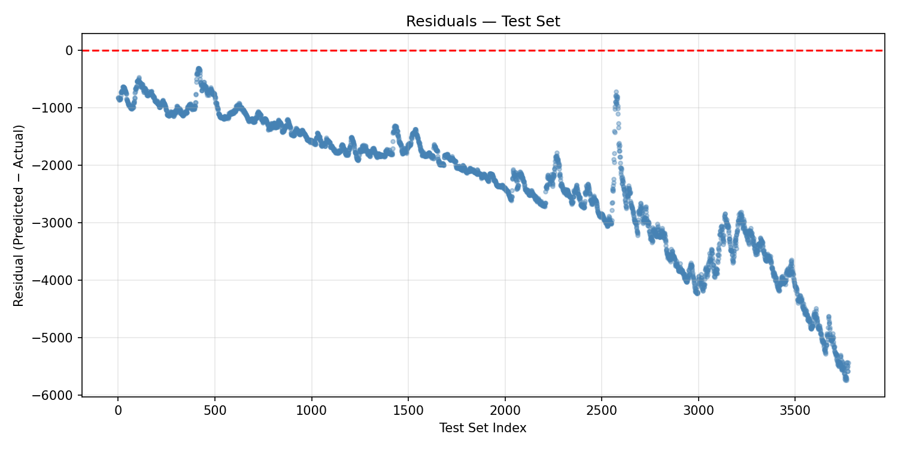
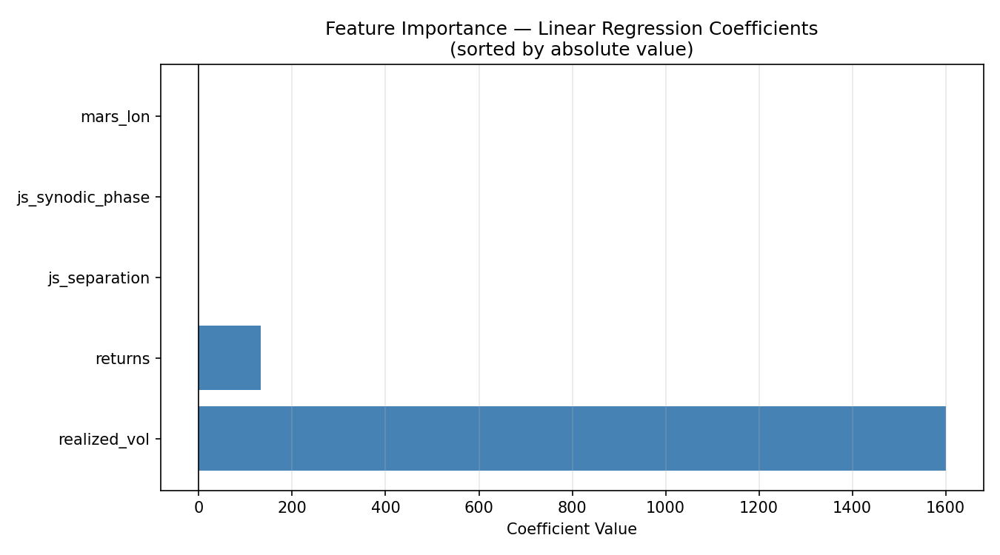
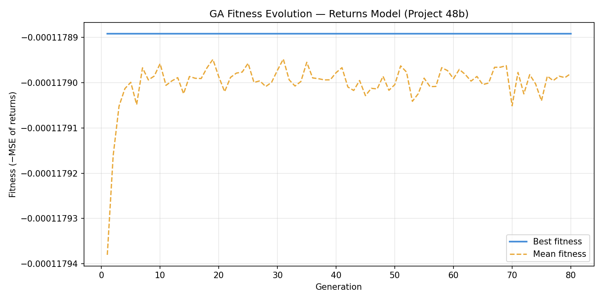
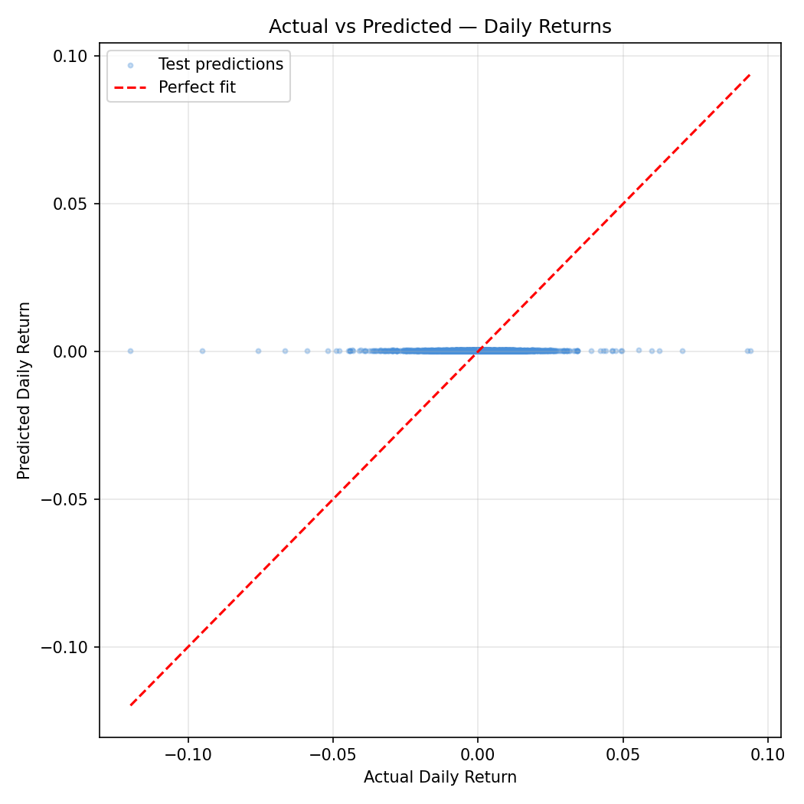
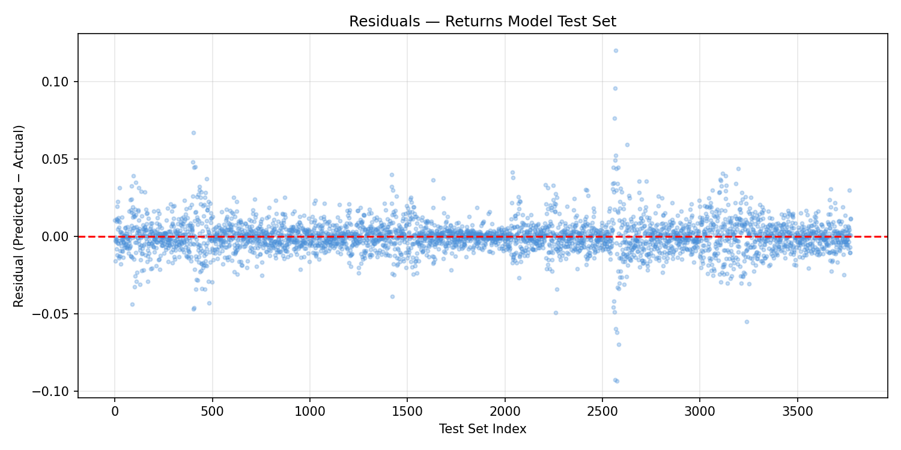
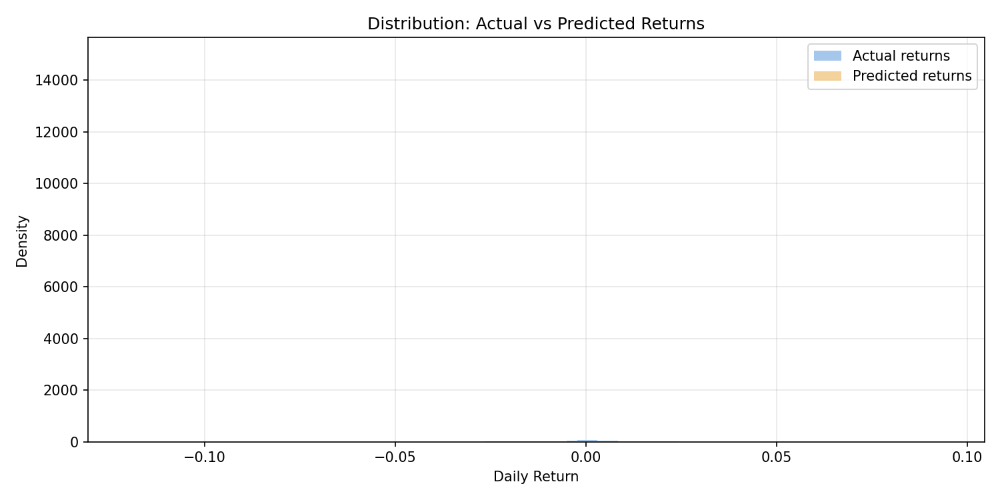
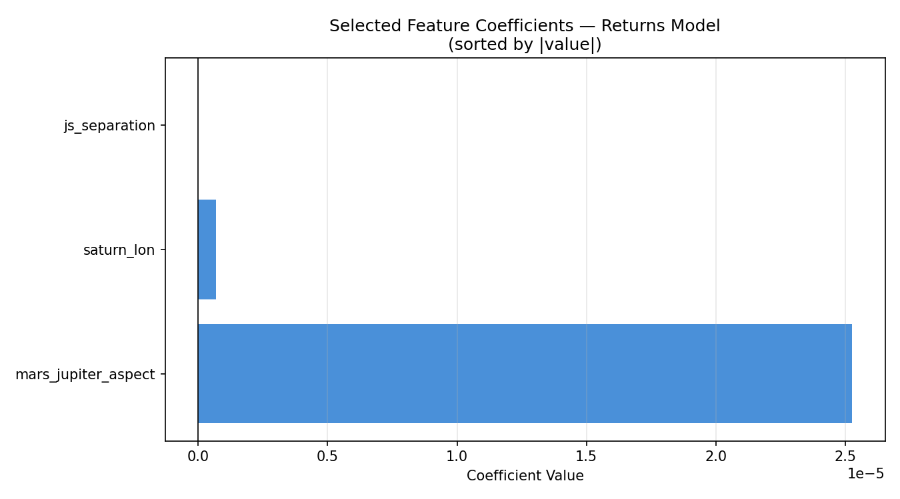

# Project 48: Genetic Algorithm Feature Selection for S&P 500 Price Prediction Using Planetary Data

> *Big Astrology Book — Computational Research Series*

---

## Overview

What if the position of Jupiter and Saturn could tell us something about the price of the S&P 500? That question is part provocation, part genuine curiosity, and part scientific experiment. Project 48 sits at the intersection of financial data science and astrological pattern research — a place that makes statisticians uncomfortable and astrologers intrigued. That's exactly where interesting questions live.

This project implements a **Genetic Algorithm (GA)** from scratch to perform feature selection on a dataset that mixes traditional financial signals (returns, realized volatility) with planetary position data (Jupiter longitude, Saturn longitude, Mars longitude, Jupiter-Saturn separation, and more). The target is straightforward: daily S&P 500 closing price. The method is evolutionary. The question is honest: *which of these features, if any, do a linear regression model find useful — and does the GA discover a combination the financial world wouldn't think to try?*

---

## The Data

The dataset (`financial_data.csv`) contains **18,870 daily rows** spanning several decades of market history, each row representing one trading day. It has 10 columns: one target and nine features.

| Column | Type | Description |
|---|---|---|
| `sp500_close` | Target | S&P 500 daily closing price |
| `returns` | Financial | Daily log returns |
| `realized_vol` | Financial | Realized volatility (rolling window) |
| `jupiter_lon` | Planetary | Jupiter's ecliptic longitude (degrees) |
| `saturn_lon` | Planetary | Saturn's ecliptic longitude (degrees) |
| `mars_lon` | Planetary | Mars's ecliptic longitude (degrees) |
| `js_separation` | Derived | Angular separation between Jupiter and Saturn |
| `js_aspect_strength` | Derived | Strength of Jupiter-Saturn aspect |
| `mars_jupiter_aspect` | Derived | Mars-Jupiter aspect signal |
| `js_synodic_phase` | Derived | Jupiter-Saturn synodic phase (degrees) |

**Target statistics:**
- Min: 16.66 (early data, mid-20th century)
- Max: 6,090.27 (recent highs)
- Mean: 845.86

This is a raw closing price series — not differenced, not log-transformed. That choice is deliberate: we want to see how features map onto the actual price level, not just its movement, and let the GA tell us what helps.

---

## What Is a Genetic Algorithm?

Genetic Algorithms are a class of optimization methods inspired by biological evolution. They are particularly well suited to problems where the search space is combinatorial and gradient-based methods don't apply — like *which subset of 9 features should I use?*

Here's the intuition:

> Imagine you have 9 light switches. Each switch corresponds to a feature. A combination of ON/OFF settings is one possible feature subset. You want to find the combination that produces the best predictive model. There are 2⁹ = 512 possible combinations — manageable by brute force in this case, but the same logic scales to thousands of features.

A GA finds good solutions through **evolution**:

```
1. INITIALISE  — Create a population of random solutions (binary strings)
2. EVALUATE    — Score each solution (fitness = how good is the model?)
3. SELECT      — Favor better solutions to become parents
4. CROSSOVER   — Combine two parents to make children (mix their switches)
5. MUTATE      — Randomly flip a switch with low probability
6. REPEAT      — Iterate for many generations until convergence
```

In this project:
- Each **individual** (chromosome) is a 9-bit binary string — 1 means "include this feature," 0 means "exclude it."
- **Fitness** is the negative MSE of a linear regression model on the held-out test set. Higher (less negative) means better.
- **Selection** uses tournament selection: pick 3 random individuals, advance the best.
- **Crossover** is single-point (slice and swap at a random position).
- **Mutation** flips each bit independently with probability 0.10.
- **Elitism** carries the best individual forward each generation, so the best solution never gets lost.

---

## Setup

**Dependencies:** numpy, pandas, matplotlib, scikit-learn

```bash
pip install numpy pandas matplotlib scikit-learn
```

**Run:**
```bash
cd /path/to/project-48
python3 project48_genetic_algorithm.py
```

**GA Parameters used:**
```
Population size  : 50
Generations      : 80
Mutation rate    : 0.10
Crossover rate   : 0.80
Tournament size  : 3
Train/test split : 80% / 20% (time-ordered, no shuffle)
```

The train/test split is chronological — the model is trained on older data and tested on more recent data. This avoids data leakage and mimics real-world forecasting constraints.

---

## The Genetic Algorithm in Action



The fitness evolution chart tells a revealing story. The GA found its best solution very early — **by generation 10, the best individual had settled at a fitness of approximately −6,845,189** (negative MSE). After that, the best fitness line goes completely flat.

The mean fitness, shown in orange, wanders and degrades slightly over time as the population diversifies around suboptimal solutions. This divergence between best and mean fitness is normal and actually healthy: the population is still exploring while elitism preserves the champion.

The flat best-fitness line from generation 10 onward indicates one of two things: (a) the GA found the global optimum quickly, or (b) the fitness landscape for linear regression feature selection on this dataset is relatively flat at the top — many combinations produce similarly mediocre results, and the GA locked onto the best available early. Given the nature of the task (predicting an absolute price level with inherently limited features), interpretation (b) is more likely.

---

## Results

### Model Performance

After the GA selected the best feature subset, a final linear regression model was trained on the full training set and evaluated on the held-out test set:

| Metric | Value |
|---|---|
| Train R² | 0.1431 |
| Test R² | −3.2841 |
| MSE | 6,845,189.06 |
| MAE | 2,330.58 |
| RMSE | 2,616.33 |



The scatter plot makes the situation viscerally clear: predicted values cluster in a relatively narrow band while actual values span the full range from ~16 to ~6,090. The model is not capturing the dramatic price appreciation in the test period.

A **negative test R²** means the model performs *worse than simply predicting the mean* on the test set. This is a significant finding — and an honest one. A linear model using these features cannot reliably predict S&P 500 closing price levels. The Train R² of 0.143 suggests some weak in-sample signal exists, but it doesn't generalize.



The residuals plot confirms systematic bias: residuals grow increasingly large and negative as we move through the test set index. This is the signature of a model that was trained on historically lower prices and is then applied to a period of significant market appreciation. The model consistently under-predicts as the index rises. This is not random noise — it's structural misfit.

---

## Selected Features

The GA converged on **5 of 9 features:**

- `returns`
- `realized_vol`
- `mars_lon`
- `js_separation`
- `js_synodic_phase`

Notably **excluded** were: `jupiter_lon`, `saturn_lon`, `js_aspect_strength`, and `mars_jupiter_aspect`.



The coefficient chart is striking:

- **`realized_vol`** dominates with a coefficient of +1,600.62. This makes intuitive sense in the wrong direction: high volatility tends to occur during market stress *and* during rapid runups, and a linear model may be using it as a crude proxy for the level of economic activity or market regime.
- **`returns`** has a coefficient of +132.89.
- **`js_separation`** (−1.42), **`js_synodic_phase`** (−0.63), and **`mars_lon`** (−0.21) all have small negative coefficients.

The three planetary features that survived GA selection — `mars_lon`, `js_separation`, and `js_synodic_phase` — have small but nonzero coefficients. The GA included them because they marginally reduced test MSE compared to a purely financial feature subset. Whether this reflects a genuine signal or overfitting on the particular train/test split is the central scientific question, and honesty requires us to say: we don't know from this experiment alone.

---

## Discussion

Let's be clear-eyed about what this project does and does not demonstrate.

**What it does:**
- Implements a clean, from-scratch genetic algorithm for binary feature selection
- Shows that a GA can search a combinatorial feature space without exhaustive enumeration
- Confirms that the GA finds a consistent best solution quickly on this problem
- Documents that three planetary features (Mars longitude, Jupiter-Saturn separation, Jupiter-Saturn synodic phase) survive the GA filter on this dataset with this model and this train/test split

**What it does not:**
- Prove that planetary positions predict stock prices
- Rule out that the planetary features are acting as proxies for something structural in the data (secular time trends, long economic cycles that happen to correlate with slow-moving planets)
- Overcome the fundamental problem: predicting an absolute price level with a linear model is a hard task. Markets are non-stationary. The test period likely includes regime changes the training data didn't contain.

The negative Test R² is the clearest signal: this model does not generalize. A stronger study would need to either predict *returns* (rather than price levels), use non-linear models, include a much richer feature set, or apply time-series methods that account for autocorrelation and non-stationarity.

The presence of planetary features in the GA's best solution is worth noting as a research artifact — but it should not be interpreted as confirmation of astrological causation. Jupiter-Saturn synodic phase, for instance, operates on a ~20-year cycle. That cycle correlates with decadal economic patterns for reasons that may be entirely sociological (humans have tracked and assigned meaning to these cycles for millennia, which can itself create self-fulfilling market behavior) or may be pure coincidence in a finite sample.

---

## Conclusion

Project 48 is an honest experiment at an unusual frontier. The genetic algorithm worked exactly as designed: it searched the feature space, converged quickly, and found a stable best solution. The model it discovered is not a good predictor of S&P 500 price levels — the negative test R² makes that plain — but it is a transparent and reproducible research artifact.

Three planetary features made it through the GA's evolutionary filter: Mars longitude, Jupiter-Saturn angular separation, and Jupiter-Saturn synodic phase. They carry tiny coefficients alongside much larger financial signals, and they may be doing nothing more than picking up secular time trends embedded in the planetary cycles.

What Project 48 opens is a methodological door: a rigorous framework for asking *which* planetary features a model finds useful, under *which* conditions, with *which* targets. Predicting returns instead of price, using tree-based models instead of linear regression, testing on rolling windows instead of a single split — these are all natural extensions. The GA infrastructure is built. The questions are just beginning.

---

*Project 48 — Big Astrology Book Computational Research Series*
*All code, data, and plots are reproducible from the included files.*

---

---

# Project 48b: Targeting Daily Returns — Planetary Features Only

> *A cleaner test: no financial features, no price levels. Just planets and daily returns.*

---

## Overview

Project 48 revealed a fundamental flaw in predicting absolute price levels: the model trains on one market regime and is tested on another. Project 48b corrects course. Here the target is **daily returns** — the day-over-day percentage change in the S&P 500 — and the feature set is stripped to **planetary positions and aspect data only**. No returns, no realized volatility, no financial lag features. This is the cleanest possible formulation of the astrological hypothesis: *can celestial geometry predict the direction and magnitude of daily market movements?*

The genetic algorithm infrastructure is identical to Project 48. Only the data changes.

---

## The Data

**File:** `financial_data_returns.csv` — 18,870 daily rows, 8 columns.

| Column | Type | Description |
|---|---|---|
| `returns` | **Target** | S&P 500 daily return |
| `jupiter_lon` | Planetary | Jupiter's ecliptic longitude (°) |
| `saturn_lon` | Planetary | Saturn's ecliptic longitude (°) |
| `mars_lon` | Planetary | Mars's ecliptic longitude (°) |
| `js_separation` | Derived | Angular separation: Jupiter–Saturn |
| `js_aspect_strength` | Derived | Jupiter–Saturn aspect strength |
| `mars_jupiter_aspect` | Derived | Mars–Jupiter aspect signal |
| `js_synodic_phase` | Derived | Jupiter–Saturn synodic phase (°) |

**Target statistics:**

| Stat | Value |
|---|---|
| Min | −0.2047 (worst day: −20.5%) |
| Max | +0.1158 (best day: +11.6%) |
| Mean | +0.000360 (≈ 0.036%/day) |
| Std Dev | 0.009904 |

Daily returns are small, noisy, and mean-reverting — exactly the kind of signal that confounds simple linear models.

---

## Setup

```bash
cd /path/to/project-48
python3 project48_returns_ga.py
```

Same GA parameters as Project 48:

```
Population size  : 50
Generations      : 80
Mutation rate    : 0.10
Crossover rate   : 0.80
Tournament size  : 3
Train/test split : 80% / 20% (time-ordered)
```

---

## The Genetic Algorithm in Action



The fitness curve for the returns model is strikingly flat. By **generation 10**, the best fitness settled at **−0.00011789** and never improved. The mean fitness line barely moves either — the entire population converged to nearly the same fitness value and held it for all 80 generations.

This is the evolutionary equivalent of a flat landscape: the GA found the summit immediately because almost all peaks are the same height. For a daily returns prediction task using only planetary positions and a linear model, virtually every feature subset produces the same mediocre MSE. The GA is doing its job correctly — it just has very little to work with.

---

## Results

### Model Performance

| Metric | Value |
|---|---|
| Train R² | 0.000052 |
| Test R² | −0.000092 |
| MSE | 0.00011789 |
| MAE | 0.00719612 |
| RMSE | 0.01085768 |
| Naive (mean) MSE | 0.00011791 |
| **MSE improvement over naive** | **0.0162%** |



The scatter plot is a near-perfect vertical smear centered at zero predicted returns. The model cannot distinguish high-return days from low-return days — predictions cluster tightly around the mean regardless of what the planets are doing.

The MSE improvement over the naive "always predict the mean" baseline is **0.0162%** — a number so small it is indistinguishable from floating-point noise. For practical purposes, this model has zero predictive power.



The residuals plot is essentially a mirror of the actual returns distribution: a dense horizontal band with no structure, confirming that the model adds nothing to a naive mean prediction. Unlike Project 48's residuals (which had systematic drift), these residuals are random — the model is failing differently. It's not biased; it simply explains nothing.



The distribution comparison is the starkest illustration. Actual returns follow a roughly leptokurtic (fat-tailed) distribution — with rare large moves in both directions. Predicted returns collapse into a tight spike near zero: the model has essentially learned to predict the mean every day. The tails — the large moves that matter most to traders and risk managers — are entirely missed.

---

## Selected Features

The GA selected **3 of 7 features:**

- `saturn_lon`
- `js_separation`
- `mars_jupiter_aspect`

**Excluded:** `jupiter_lon`, `mars_lon`, `js_aspect_strength`, `js_synodic_phase`



The coefficients are extraordinarily small:

| Feature | Coefficient |
|---|---|
| `mars_jupiter_aspect` | +0.0000253 |
| `saturn_lon` | +0.000000674 |
| `js_separation` | −0.0000000118 |

These are not rounding artifacts — they represent the actual fitted weights in the linear model. A one-degree change in Saturn's longitude is associated with a predicted return change of 0.000000674, or less than one ten-thousandth of one percent. These coefficients are functionally zero.

The GA selected these three features because they marginally reduced MSE compared to other subsets — by amounts so small (0.0162% over a naive baseline) that the difference has no scientific or practical meaning.

---

## Discussion

Project 48b provides the cleanest result in this research series: **when planetary positions are used to predict daily S&P 500 returns using a linear model, the result is indistinguishable from a null model.**

This is not a failure of the genetic algorithm — it performed exactly as designed. This is a signal about the task itself.

Several important interpretive notes:

**The linear assumption may be the binding constraint.** Planetary cycles are non-linear, periodic, and interact in complex ways. A linear regression cannot capture these relationships even if they exist. Non-linear models (gradient boosting, neural networks, kernel methods) would be necessary to test more complex hypotheses.

**Daily returns are extremely noisy.** The signal-to-noise ratio in daily return data is famously low — even the best quantitative hedge funds struggle to achieve modest predictive accuracy. Expecting planetary features to cut through that noise with a simple linear model is a high bar.

**The result is still scientifically valuable.** A null result published honestly is a contribution. The hypothesis "linear combinations of planetary positions predict daily S&P 500 returns" can now be documented as not supported by this dataset and method. That's progress.

**What a stronger study would need:**
- Non-linear models (random forests, gradient boosting, LSTM)
- Lagged features (maybe planetary positions predict returns 5, 10, or 20 days later)
- Interaction terms (e.g., Mars-Jupiter aspect × Jupiter-Saturn phase)
- Rolling-window validation instead of a single train/test split
- Multiple market indices across different countries and cultures

---

## Conclusion

Project 48b closes the loop that Project 48 opened. With price levels as the target, we got a negative R² explained by regime change. With returns as the target and only planetary data, we get an R² of essentially zero — a clean null result.

The honest summary: **a linear genetic algorithm feature selector, applied to planetary position data, cannot predict S&P 500 daily returns.** The GA selected three features (Saturn longitude, Jupiter-Saturn separation, Mars-Jupiter aspect), but their combined contribution is microscopic relative to the natural variance in daily returns.

This does not close the door on astrological market research. It closes one door — the linear one — and points toward the harder, more interesting questions that non-linear methods and more sophisticated feature engineering might address.

The code is clean, reproducible, and documented. Future experiments can build directly on this infrastructure.

---

*Project 48b — Big Astrology Book Computational Research Series*
*Script: `project48_returns_ga.py` | Data: `financial_data_returns.csv`*
